# Journal: StockSynth

## My Process:

### 7/25/2026 - The start
I started with a basic idea of drawing a stock graph and adjusting the pitch according to how well the stock did. I made a basic main menu screen and I searched for an API. I landed on twelvedata, as it allows 8 API credits per minute and up to 800 per day, for free. It's not the absolute best solution as you need to register for an account, but it allows as many users as needed to use the program at the same time, as there isn't one API key being used. I laid out a basic prototype, it simply drew stock data from Tesla from the past 30 minutes and played a synth constantly that pitched up and down. It drew a graph using a Line2D node and had a scanline that followed the graph. It was hard to research how to do this, but I eventually got a working prototype out!

#### The first working prototype, it was at a 30m interval and had no controls except for what stock you could pick!

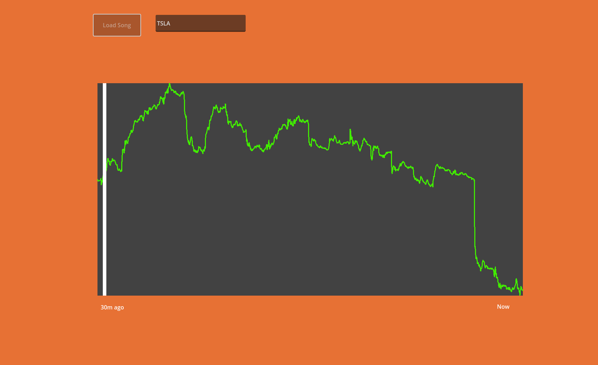

--- 

### 7/26/2026

- #### Morning update:
I polished a lot so far! I custom made a synth in FL Studio using 3x Osc. This synth is static and has no attack or release, so it's the same sound throughout the entire note. This allows the note to be replayed or constantly played and have no affect on the listening experience. I added a volume slider, custom ticker selection box so you can select which stock you want to track, and adjusted the resolution to 1600 points and the time to a month. I also coded a system to dynamically adjust the volume, as when the pitch is low the synth sounds very quiet, but when it becomes louder it can be overwhelming. I also quickly added a low pass filter to cut the high annoying frequencies out. I had to implement this with the volume control as it's constantly adjusting the volume dynamically. The volume control simply applies an offset to the automatically calculated volume.

The actual system is pretty simple! It checks if the stock ticker is valid. If it is valid, it checks the cache to see if the same ticker is stored in there. This saves on API credit usage, as if you're rapidly calling the same ticker you won't use up a bunch of credits. If it isn't cached, it calls the API. There is an error logging system that prints any errors in Godot's output, and obviously the cache system which will save stocks that you call. Then, it will calculate the min/max stock price so that the graph scales correctly, and maps each data point to a point on the graph. The scan line is then set to visible, and moves along the graph. The pitch is updated every 0.03 seconds and the synth audio starts. It's also smoothed out to avoid harsh sounds. The scanline will loop indefinitely, until you select a new ticker, as will the audio.

#### In this picture you can see some of the code! This handles HTTPS/twelvedata errors, and then grabs the data, reversing it so it displays oldest -> newest. Then it caches the price data, again to save on API usage.

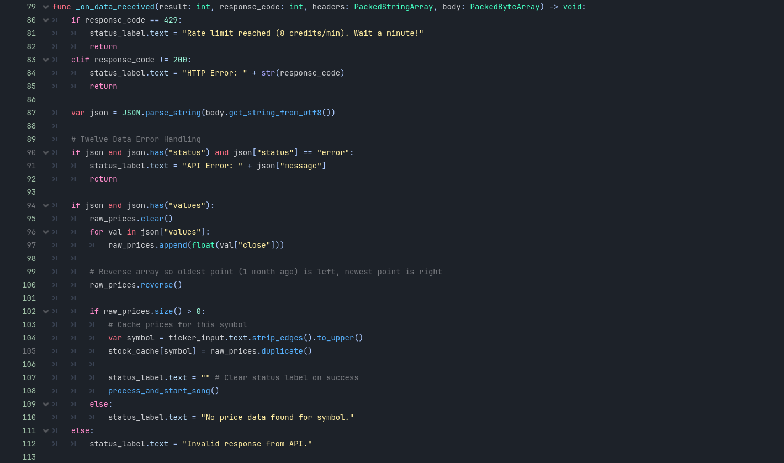

---

- #### Update 1:
I implemented a timescale system! You can now select from several options, ranging from 1 day history to 1 year history. It automatically calculates the resolution within the limits of the API, so it will have less data points for a 3 day history than it would for a 6 month history. 

You can see some improvements I made to the main menu, and also in the 2nd picture you can see the new timescale option and a volume offset option as well!

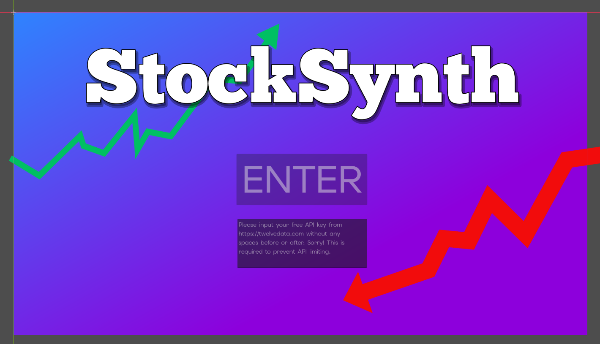

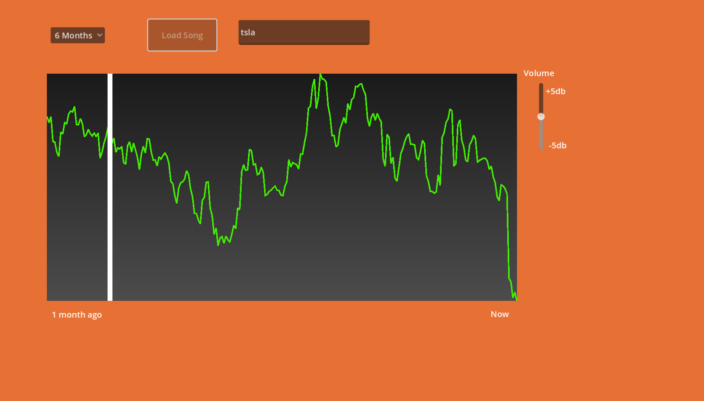

--- 

- #### Update 2:
I implemented two synth windows in the main scene! For now they are both set to the default synth, but I'll add a dropdown menu soon so you can select a wide variety of sounds, including drums, bass, etc.
I also updated the synth sound to be a few seconds long instead of a few minutes long. This drastically improves both performance and loading times, now taking a few hundred milliseconds vs. a few seconds, meaning it loads over 10x faster!

You can see I updated the filesystem to look a lot better and be organized!

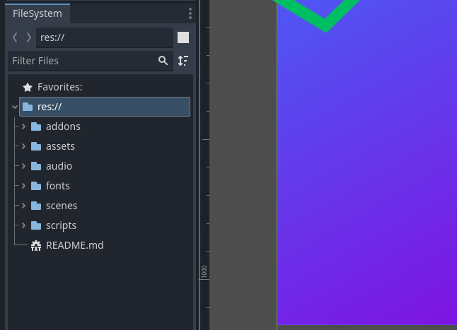

Here you can see the two windows I added! These would soon be updated to have multiple selectable sounds.

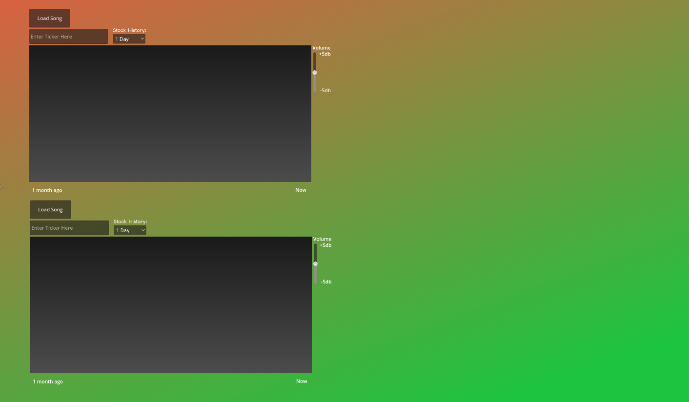

---

- #### Update 3:
BIG UPDATE!!! I handmade 7 total sounds in FL Studio using 3x osc, FLEX, and Sytrus. A hihat, kick, 2 synths, a woodblock sound, and several plucks. For each window, you can now select which instrument you want to be played. To make the instruments work better together, you can adjust their update rates, all the way from 30ms (good for static synths that update smoothly) to 1920ms (good for kicks or spaced out instruments). I also decided to increase the number of windows to 4 total, so you can essentially assemble an entire song. Because of the vast range of instruments, I also added a manual pitch offset slider. This makes sure your instruments are pitched how you like them!

I also spent a bit of time tidying up the main menu and main scene. It's nowhere near done aesthetically, but I thought I would at least try to make it look a bit nicer.
smaller things: made comments on my code readable, everything is explained. Not sure if this is specific to update 3 but I cleaned up the filesystem with almost all files in folders

Here you can see some of the comments I improved in my script.

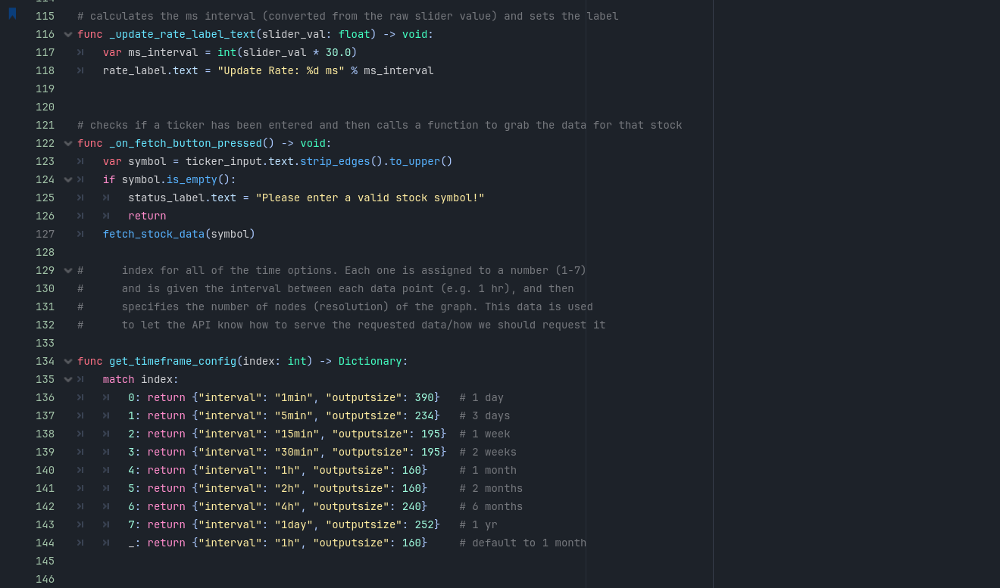

Here you can see there are now 4 windows, update rate slider, pitch offset, and a list of instruments I made in FL Studio!

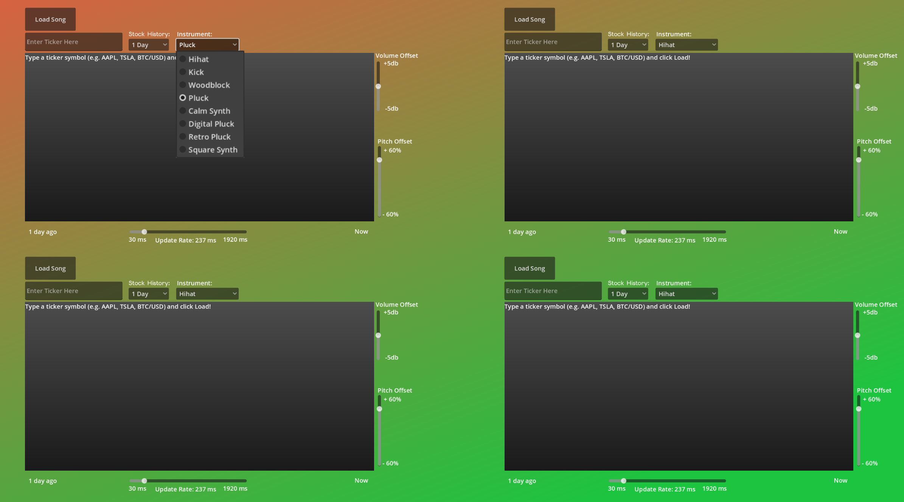

Sneakpeek behind making the sounds in FL Studio!

![FL Studio][documentation/pic13.png]

---

### 7/27/2027
- #### Update 1: This was originally update 4 yesterday, but I ended up finishing this update in the early morning hours of Monday. There are a ton of QoL improvements with this update! I made the main menu look great, with custom buttons designed in Canva. I changed all fonts to something nicer, and I added a changing dynamic gradient background for the main scene. I made a tutorial menu with a tutorial to get a free API key and another one to get people started using the graphing feature. I also added a stop button for the synth windows, and laid out the main scene a bit nicer. There is also a scrolling list of 60 popular stocks with their symbols, so people can quickly search up their favorite companies! Most of this update was aesthetics focused and I improved allignment across small elemenents and styled them nicer.

- #### Update 2: Added a scan line and info for hovered data points on the graph. I thought it would be cool to include! More small font/aesthetic improvements. Also added particles that follow the scanline, will have to tweak those though! 

These pics are for both updates, not sure when I added everything specifically so I decided to bunch everything together.

First, I revamped the main menu! It has a link for the API key, a tagline, better fonts, and the new tutorials menu!

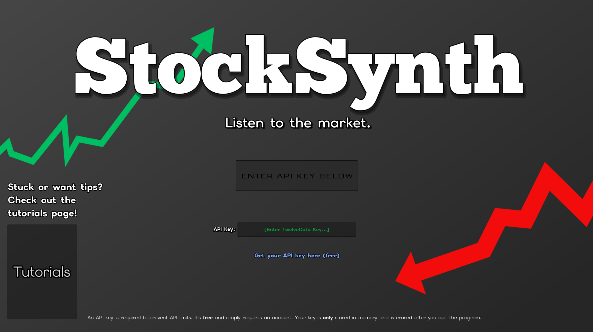

Here's a preview of the API key tutorial and the main tutorial. It's pretty simple but it's useful for users that don't know what to do!

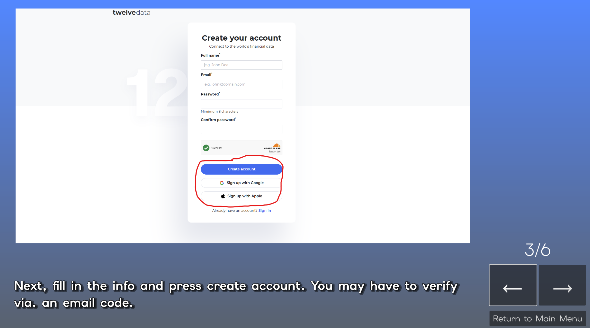

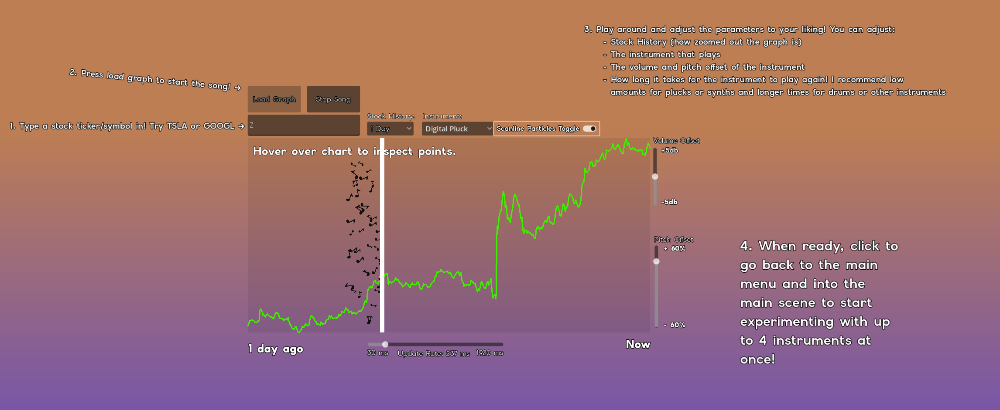

This is the main screen. You can see a lot here. There's a stop button, revamped fonts, particles toggle, and a changing background. You can also see the scrolling list of popular stocks on the very right.

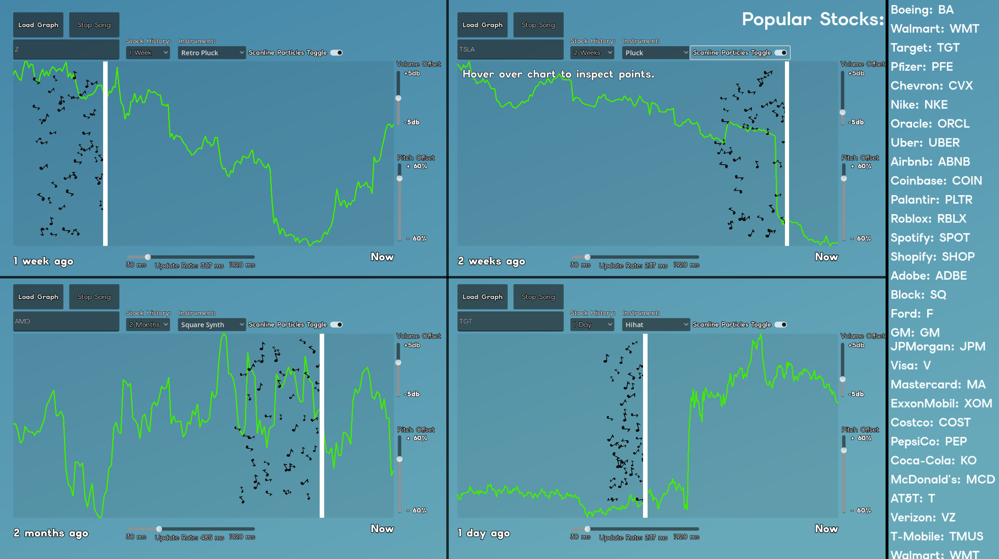

Some of the code behind the hover system. It gets your position, translates it into the corresponding data point, and displays the info as text!

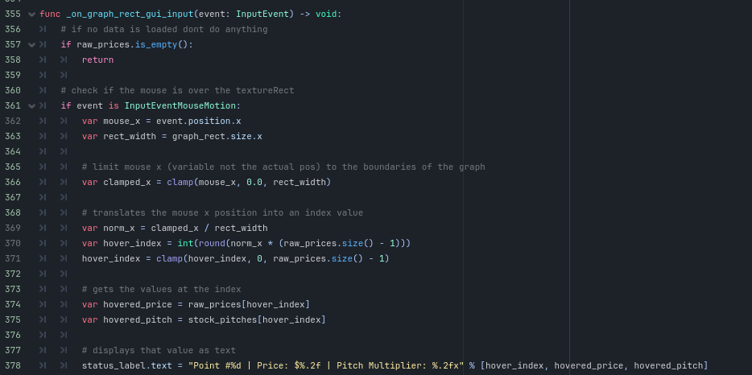

---

- #### Update 3: I added some cool stuff! I edited the effects of the particles, and added a visualizer for the wave of audio being played currently. How this works: Instead of routing all 4 synth instances (windows) through the master audio bus, it assigns each synth to a seperate audio bus. Then, each of the 4 busses has a "capture" effect where we can capture the audio currently being played. We get the data, and then build a graph using a Line2D that rebuilds points constantly so it can update quickly. All audio from the 4 buses is then routed to the master bus so it can be heard. I never knew Godot came with a audio system as nice as the current one, so it was cool to learn about it and utilize it in this project! I also had some trouble drawing the graph at the desired location and had to mess around with bugfixes until it finally got working.

Here you can see all 4 buses, they all route to the master bus at the end.

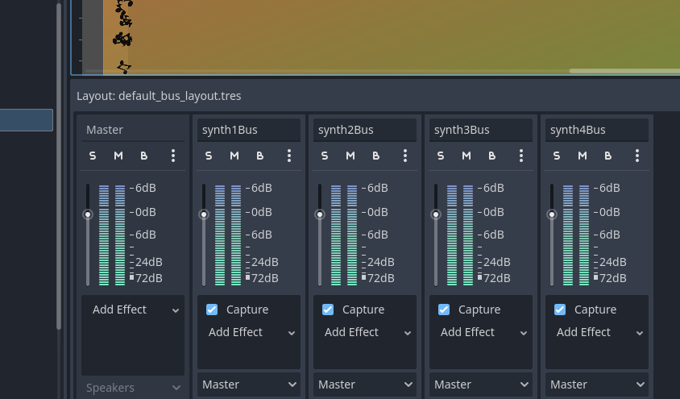
 

---

- #### Update 4: It's been a while since I edited this journal. Originally, I wanted to create a recording system so you could record your audio and have it saved to your userfolder. This was buggy and I didn't get it to work, so I eventually abandoned the project. It was really hard to figure out Godot's audio system and how to capture and write the audio data to a file. Instead, I added three new effects. For each panel, you can now adjust reverb, distortion, and delay on the fly. I originally planned for two or three more effects, but they didn't work well so I decided these 3 were enough. It was fairly difficult to implement, I had to create the effects on all 4 audio busses, which took about 20 minutes to tweak all of the values (I had to edit each effect 4x, once for each bus, so there were like ~120 values I had to edit). After that, I had to figure out how to actually apply the effects via. the sliders. It ended up not being very difficult though as I just had to connect a few functions in order to get it to work.

Some behind the scenes:
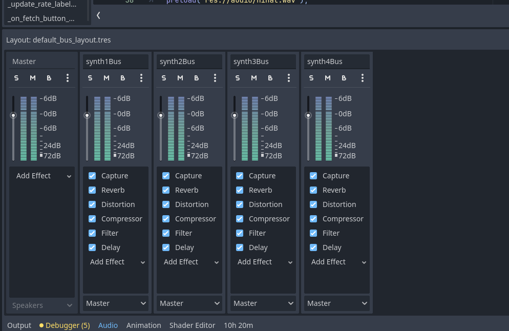

---

- #### Update 5: Close to 20 (tracked, I've worked for a good amount more than 20) hours worked on this project so far! This will most likely be the last major update. I fixed a lot of small bugs, as well as deleting the infinitely scrolling list of stocks and instead replacing it with a button that shows/hides a list. This increases the amount of space on the screen and reduces clutter.

As well as these small improvements, I made the default splash screen a static grey box, but I added a fake loading screen that takes a few seconds to dissapear. I loved using tweens to smoothly fade the elements of the loading screen. 

---

### Final thoughts:

I loved making this project! Even though I spent an insane amount of time on it over the past few days, it's been a great learning experience and has taught me so many things about Godot I didn't know before that I can now utilize in future projects! I learned a bunch of things in FL Studio too, and I really enjoyed how creative this project was. I got to make custom sounds, UI, and other features that were a nice twist of fun from the usual coding. I've never used https and APIs or really anything network related before, and this project was a great chance to get more experience in Godot and share my creativity! 
I learned a ton of things about making projects look more aesthetically pleasing, as a large point of this project was aesthetics based and I really needed to focus on small details like picking good fonts and making sure elements lined up with each other. 

--- 
- #### Update 6: Small changes! I added another tutorial. This is the effects tutorial, which teaches you what each effect does and how to utilize them in your songs! I also added dynamic loading messages! There are over 30 possible loading messages now and they change several times throughout the loading process. I also adjusted fonts and buttons so that the UI looks a lot cleaner! The effects tutorial also features gradients over a picture of 1 of the 4 windows, so that when it's talking about a certain slider that slider lights up on the picture. I also added tips that cycle every few seconds in the main scene, so it's a lot easier to make good songs! I hope you guys enjoy this project, it's been super fun to work on! This is most likely one of the final updates for the game!

---
